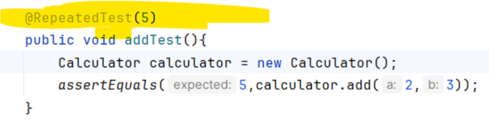
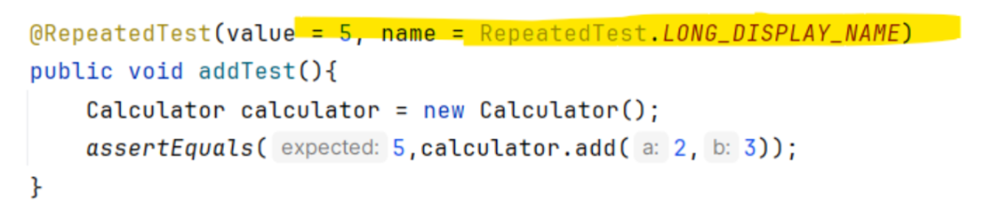
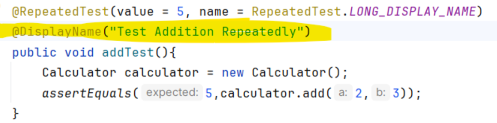
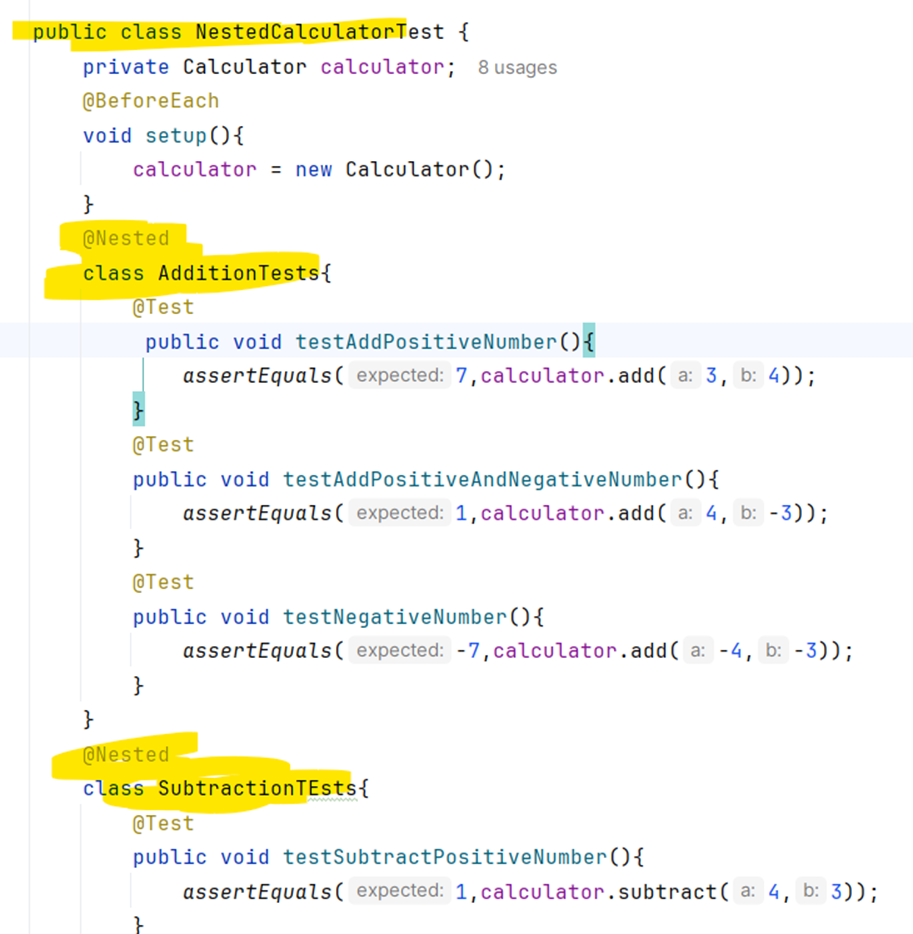
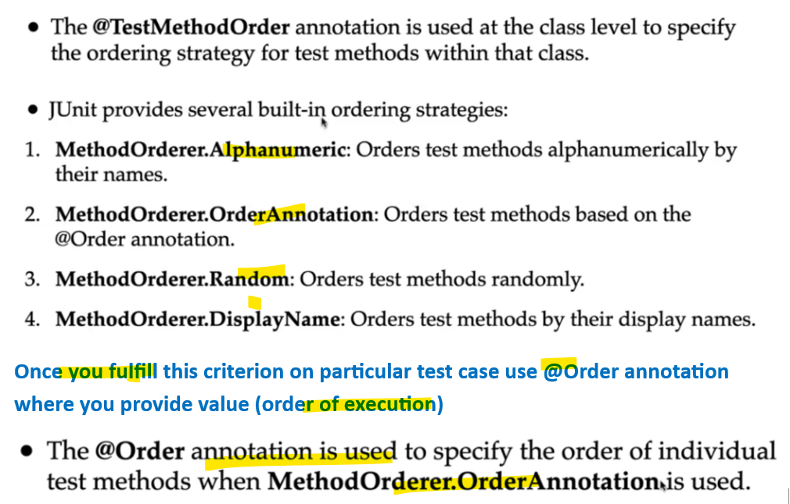
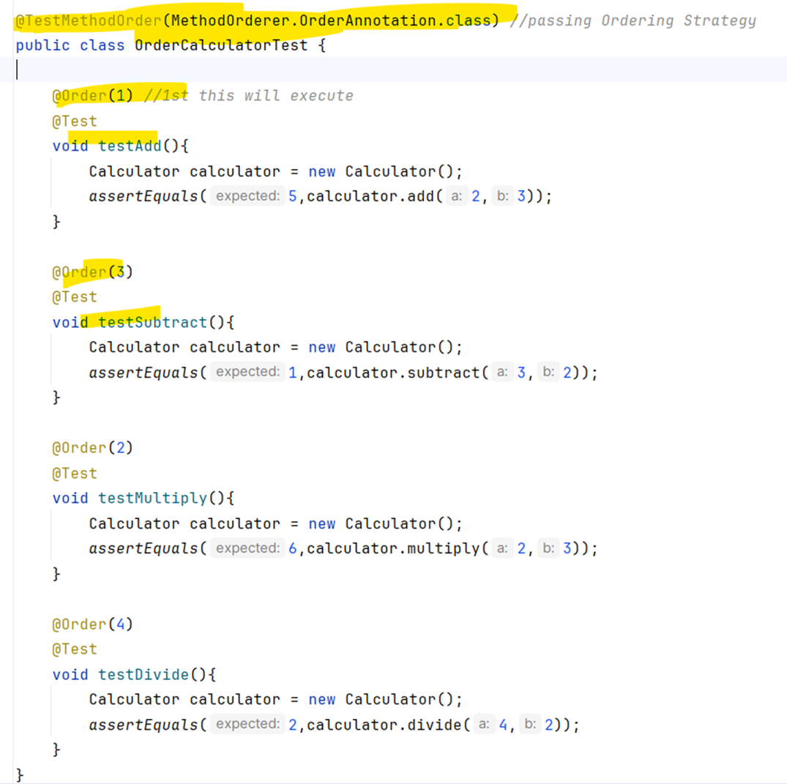
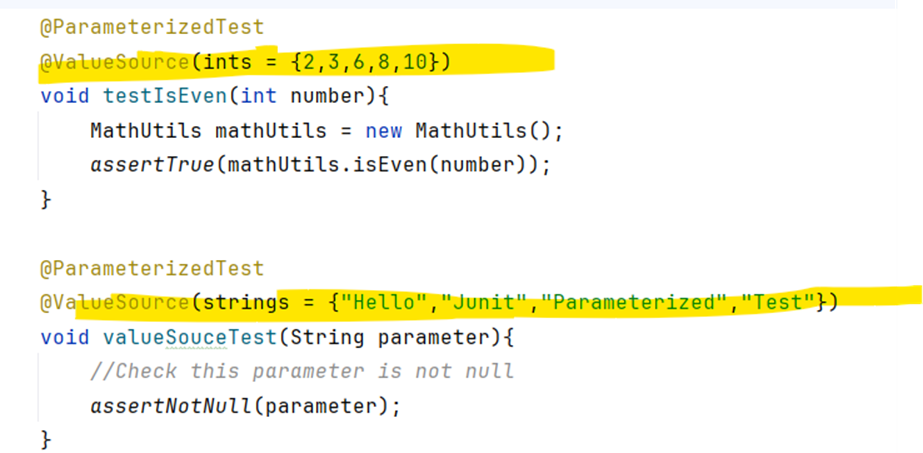
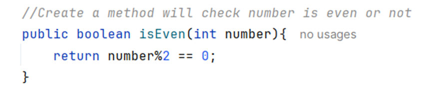
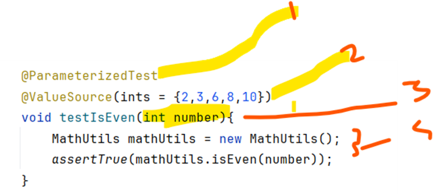

## 7. Intro
- Junit helps us to verify that the individual unit of code in java is works or behaves as expected.
- Via Junit we can write and run repeatable tests.
- It is a testing framework for java.
## 8. Junit Basics Terminology
### System Under Test/ Class Under Test
- The Java class code we want to test is SUT.
### Method Under Test
- The particular method we want to test is MUT.
### Test class
- Normal java class contain 1 or more test methods.
### Test method
- Test method are annotated with @Test annotations.
- Contans  assertions 
### Assertions
- Assertions are used to check wheather the code under test behaves as expected.
### Test Runners
- Test Runners is responsible for exections of all test methods and display it's result.
- Provided by 
    - IDE like IntelliJ or eciliplse 
    - and build tools like maven and gradle
## 9. Setup
- Create fresh project
    - Give proper name and location
    - choose build tool maven
    - choose jdk 21
    - provide package.
    - Add proper dependencies of junit jupiter.
    - check screenshots.
## 10. 1st Junit Test
- Create SUT 
    - Calculator.java
    - contianing add() method which simply add 2 integers.
- Create JunitTest class
    - Create Junit Test mehtod via @Test annotation
        - Create object of SUT
        - call actual method 
        - Write assertions.
## 11. About @Test annotation
- Test Class Visibility
    - public or default
- Test method visibility
    - public, protected or default
- Write SUT for Factorial containing factorial method
- Write Juint for this.
## Quiz
### What is the use of Junit in java pgm?
- To perform Unit Testing
### Annotation to denote the test method?
- @Test
### What is Method under Test?
- The method being tested in Junit Test case.
### What it the role of Test Runner in Junit?
- To execute test method and report the result.
### Statement true about @Test annotation?
- A test method with @Test annotation cannot return any value.
### What exception is thrown when Test fails in Junit?
- AssertionError
### Visibility for method annotated with @Test?
- public, protected and default.
## 12. About assertTrue
- There are overloaded method in assertTrue
- Create Student class
    - int id and String name
    - Constructor
    - Getter Setter
- Create StudentService class
    - Contian list of Student
    - getStudents() return list of Students
    - addStudent(Student s) added Student in list
    - This is SUT
- Create Test class
    - create instance
    - call method
    - perform opertions
    - Verify
### About BooleanSuplier
- BooleanSupplier is an Function Interface.
- introduce to support FI java8 feture
- evaluated lazily
    - It means logic is executed when an asertions is executed.
### About Suplier 
- Supplier is also FI
- same story as above
### Various method
- assertTrue(boolean condition)
- assertTrue(BooleanSupplier conditon)
- assertTrue(boolean condition,String message)
- assertTrue(BooleanSupplier con,String message)
- assertTrue(boolean cond, Supplier<String> msg)
- assertTrue(BooleanSupplier cond, Supplier<String> msg)
### Covering positive and negative scenario for all See Screnshots.
## 13. About assertFalse
- vice versa of assertTrue method
## 14. About assertNull method
- Create a new method in StudentService class
- Student getStudentById(int StudentId)
    - apply stream in list
    - then filter
    - find first
    - orElse() if not found then return null
- IN junit
- assertNull(Object actual)
    - Create instance StudentService
    - Create Student
    - Add student to StudentService
    - Call method for testing
    - verify it
    - check positive and negative scenario
- repeat for
    - assertNull(Object actual,String msg)
    - assertNull(Object actual, Supplier<String> msg)
## 15. About assertNotNull method
- vice versa of assertNull method
## 16. About assertEquals method
- assertEquals(int expected, int actual)
- assertEquals(String expected,Stirng actual)
- assertEquals(Object expected,Object actual)
- assertEquals(int expected, int actual, String msg)
- assertEquals(String expected,Stirng actual, Supplier<String> msg)
- see screenshots
## 17. About assertNotEqulas method
- assertNotEquals(int expected,int actual)
- assertNotEquals(String expected,String actual)
- assertNotEquals(int expected,int actual, String msg)
- assertNotEquals(String expected,String actual, Supplier<String> msg)
- assertNotEquals(Object expected,Object actual)
## 18. About assertArrayEquals()
- Student
    - add String department (id, name, department)
    - constructor 
        - Don't update existing constructor, if u do this then it will break existing functionality
        - add new one (id, name, dept)
    - getter setter
- StudentService
    - String[] getStudentNameByDepartment(String dept)
        - stream
        - filter via dept
        - map (fetch only student name)
        .toArray() (convert stream to Array it will take type)

- verify
    - assertArrayEquals(String[] ex,String[] actual)
    - assertArrayEquals(String[] ex,String[] actual, String msg)
    - assertArrayEquals(String[] ex,String[] actual,Suppiler<String> msg)
    - assertArrayEquals(Integer[] ex,Integer[] actual)
    - assertArrayEquals(Integer[] ex,Integer[] actual,String msg)
    - assertArrayEquals(Integer[] ex,Integer[] actual,Supplier<String> msg)
    - check screenshots
## 19. About assertIterableEquals()
- StudentService
    - Create method List<String> getStudentNameListByDepartment(String department)
    - stream
    - filter via dept
    - map (fetch only name)
    - collect(Collector.tolist); convert to list

- verify
    - assertIterableEquals(Iterable exp,Iterable actual)
    - assertIterableEquals(Iterable exp,Iterable actual, String msg)
    - assertIterableEquals(Iterable exp,Iterable actual, Supplier<String> msg)
- cehck screenshots.
## 20. About assertThrows() method
- If exception is thrown the method will pass and vice versa
- Concept of Inheritance hierarchy
    - StudentNotFoundException extends RuntimeException then you can throw either of them no worries.
### Create Exception

### Create method
- Stream
- Filter
- findFirst
- orElseThrow() here you throw your exception
Method

### actual calling
- assertThrows(Class expected, Executale ex)
- assertThrows(Class expected, Executale ex,String msg)
- assertThrows(Class expected, Executale ex,Supplier<String> msg)
- Exception hierarchy
- Check screenshots
## 21. About assertThrowsExactly() method
- It does not support inheritance type hierarchy.
- U want to throw exactly type of exception in order to pass the test;
    - else test will fails.
- In our StudentService class we throw StudentNotFoundException.
    - This this will be thrown everytime in order to pass the test

 
### In RuntimeException Case
- If you throw RuntimeException
	- The test fails
### Calling function
- assertThrowsExactly(Class expectedType, Executable exe)
- assertThrowsExactly(Class expectedType, Executable exe,String msg)
- assertThrowsExactly(Class expectedType, Executable exe,Supplier<String> msg)
### In NullPointer Case
- If you pass NullPointerException
	- The test fials.
### Also return an Exception type
- The assertThrowsExactly() method return the exception type also. 
    - U can paly with it
- Check screenshots.
## 22. About @DisplayNames annotation
- @DisplayName annotation provide custom name for test class and test methods.
- U can used names, special characters and emojis
- see screenshots
## 23. About @Disabled annotation

- @Disable annotation allows you to prevent specific test method or test class from being executed.
- U can also provide custom message in this annotation.
- check screenshots.
## 24. Lifecycle annotations
### @BeforeEach
- Runs before every single test method
- Reset Calculator to zero before each test
### @AfterEach
- Runs after every single test method
- If you open file during test. Close it via this annotation.
### @BeforeAll 
- executes once before all test in a class
- Connecting to db
### @AfterAll
- executes once after all test in a class
- Closing db connection.
## 25. About @BeforeEach annotation
- If u want to set some initial condition before each test case. 
- Then you should go for @BeforeEach annotation.
- Eg: If you are testing a calculator then you want might to reset calculator to zero before each test.
### Calculator class
- Containing logic about add, subtract, multiply and division.
### Testing class

- Basically, u set Calculator instance in every test case. 
- For every test u require calculator instance.
- Testing class
	- Declare Calculator 
	- In setup method which is annotated with @BeforeEach annotation.
	    - U initialize instance of calculator.
    

## 26. About @AfterEach annotation
- If you want your logic is executed after each test case. Then go for @AfterEach annotation.
- IF you open a file during test, then for next test you need all resource (i.e. file) to be closed properly.
- teardown()
    -	Here we have object
    -	Set it null.
## 27. About @BeforeAll annotation
- If you want to execute method once before all the test methods in the test class, then go for @BeforeAll annotation.
- Method must be static
    -	It share the resources among all test methods.
    -	It should be call before creating an object
- Eg:
    - Connecting to db is an expensive task. We should write this logic via this annotation.

## 28. About @AfterAll annotation
- If u want to execute a method once after all test method then u should go for this annotation @AfterAll.
- Why method must be static?
    -	as we are going to clean up the shared resources.
    -	So, make sure that you make you know method as a static.

## 29. About RepeatedTest annotation
- If u want to execute a test multiple times, then go for @RepeatedTest annotation
### U can specify the number directly in @RepeatedTest annotation

### U can use name attribute to make your test case more readable

### U can customize test case name (@Display + @RepeatedTest)

### U can use life cycle methods with @RepeatedTest annotation
-	See screenshots.
-	Remember- don’t bother about order of execution of test case
-	Just check the method which is annotated with @BeforeAll and @AfterAll annotation is executed at least once.
## 30. About NestedClass
- If you want to logically organize related tests into one group then u go for @Nested annotation.
### Rules:
-  An outermost class cannot be nested.
- An inner class will be non-static class.
- Use @Nested annotation on inner/nested class and not on test methods.
### Remember:
- If we execute Parent class then all test cases which are present in nested class will automatically be executed.
### Pgm:
- We group  testAddPositiveNumber(), testAddPositiveAndNegativeNumber() and testNegativeNumber() method in AdditionTests Nested class
- Similarly, We group testSubtractionPositiveNumber() and testSubtractLargerFromSmaller() into SubtractionTests Nested class.
### We can also write Nested class within another Nested class
-  So Inside Subtraction Nested class we write Another Nested class ie. EdgeCases.

## 31. About Test Execution Order
- Junit executes test randomly in any order.
- So, if you want to executes the test method in any particular sequence then go with this concept.
### Rules:
- Annotated particular test class which test method you want to execute with particular order with @TestMethodOrder 
- Inside this Annotation @TestMethodOrder you have to provide ordering strategy.
    - Ordering Strategy is Alphanumeric, Order annotation etc.

- check screenshots.
## 32. About Test Suite
- If u want to execute collection of test cases together and simultaneously then go for test suites.
- For this add dependency
    -	Junit-platform-suite-engine
    -	Also add dependency Junit-Jupiter-engine. 
        - If you failed to add this dependency landing an error like fail to discover test. (Check ScreenShots)
- If u want to test single class
    - @SelectClasses
         - pass single class
    - For multiple
	    - Pass multiples classes in { } curly braces
- Similarly for package.
- See screenshots.
## 33. About Parameterized Test
- Parameterized test allow developer to run same test case with different inputs/arguments/parameter.
- Added Junit-Jupiter-params dependency.
- Indicating the below test method is Parameterized test method via @ParameterizedTest annotation.
- Various Source types like value Source, Enum source etc..
## 34. About Parameterized Test
- @ValueSource annotation takes arrays of literal/primitive values.
- Primitive values like int, short, String etc. 
- So, if you provide multiple integer number you can provide via ints

- Add dependency for JUnit-Jupiter-params
### At class under test create isEven() method

- If you write multiple test case just to provide different input. 
    - Drawbacks explain see screenshots.
### How to write Parameterized Test
-	Annotate test method with @ParameterizeTest annotation
-	Provide @ValueSource and values in it
-	Define parameter in method
-	Write test case

